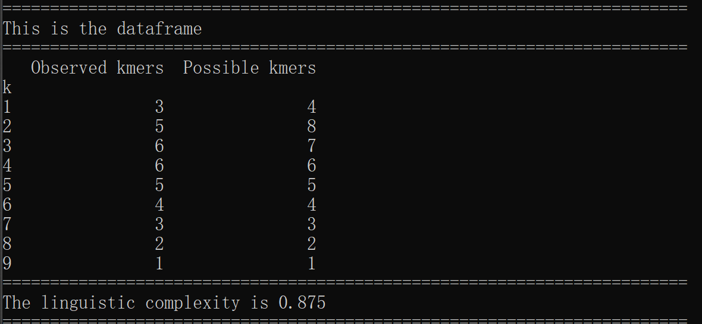
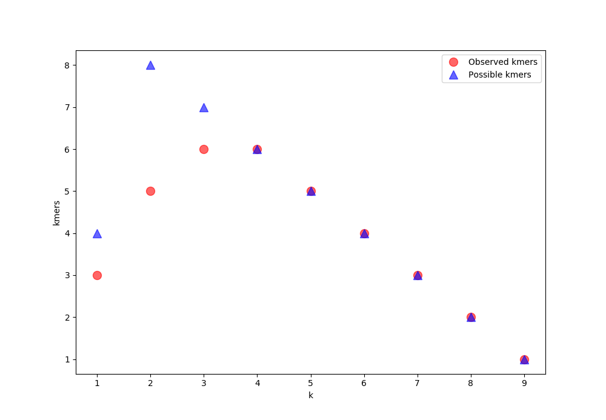

# python_assignment
## Zhuo Zhao 100636803
* The file kmers.py has five functions
1. kmers_possible(k, sequence) is used to calculate possible kmers given k and sequence
2. kmers_observed(k, sequence) is used to calculate observed kmers given k and sequence
3. create_dataframe(l, sequence) is used to create dataframe. l is the length of the dataframe. 
4. graph(df) is used to draw a dot graph for possible kmers and observed kmers
5. complexity() is used to calculate the lingustic complexity

* The file test_kmers is the script that tests all of the functions above

* The main function is written as ```if __name__ == '__main__' ```

The expected result after running the program


